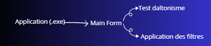

# Documentation

Nous avons opté pour le langage c# car nous avons appris ce langage durant notre cursus. 

## Comment fonctionne notre solution

Vous lancez l'éxécutable et vous arrivez sur la fenêtre principale.
Vous pouvez effectuer le test de daltonisme pour savoir si oui ou non vous êtes daltonien et de quel type! 
Par la suite vous choisissez le type de filtre en fonction de votre daltonisme
Vous pouvez désormais jouer en toute tranquilité, bon gaming à vous !

## Voici comment notre solution est construite

Il y a un main form ensuite les autres forms sont lancés. 
Pour le test de daltonisme nous stockons les choix qu'ils soient mauvais ou correct dans un vecteur de booléen. A la fin on parcours le vecteur et en fonction des résultats on détermine le type de daltonisme. 

## Pour finir 

Notre logiciel utilise la licence MIT, c'est un projet communautaire n'hésitez à faire des pulls requests !